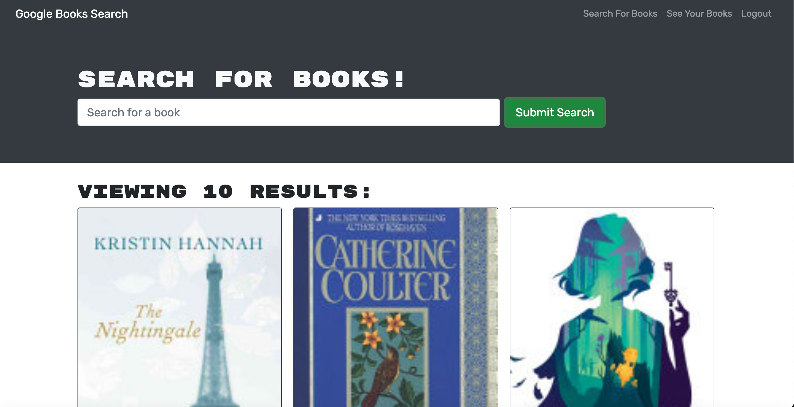

# Book Search Engine

## Description
A full-stack application utilizing the GoogleBook API to search for books of the user's choice.

View the deployed application [here](https://pure-beach-38994.herokuapp.com/)!

## Table of Contents
* [Technologies](#technologies)
* [Installation](#installation)
* [Questions](#questions)

## Technologies
- JavaScript
- Apollo-Server-Express
- Express
- Bcrypt
- GraphQL
- Mongoose
- Jsonwebtoken
- Node
- NPM

## Installation
Dependencies are already written in the package.json, but once the repository is downloaded or cloned, be sure to type "npm install" in your terminal to install all dependencies.

## Questions
For any questions, comments, or suggestions, I can be reached at kelleyajessica@gmail.com.
 
 
Check out more of my projects here: [https://github.com/JessicaAKelley](https://github.com/JessicaAKelley)